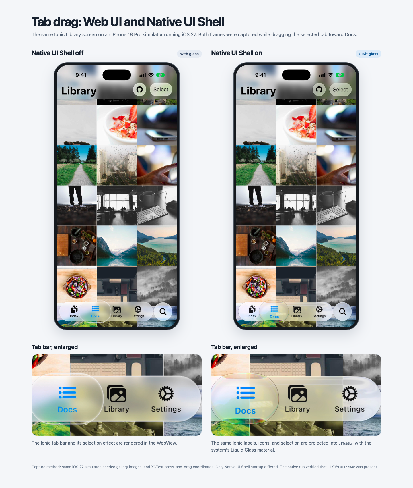

# Ionic Theme iOS27

A theme for Ionic apps that brings iOS 27 Liquid Glass and motion to the Web, with an optional way to project existing Ionic controls into native UI.

> [!IMPORTANT]
> This `main` branch contains the iOS 27 theme under the package name `@rdlabo/ionic-theme-ios27`. For the iOS 26 theme (`@rdlabo/ionic-theme-ios26`), see the [`ios26` branch](https://github.com/rdlabo-dev/ionic-theme-ios27/tree/ios26).

> All versions before 1.0.0 are release candidates (RC). APIs, CSS variables, classes, styling, and behavior may change without backward compatibility, including in minor and patch releases. A stable compatibility commitment starts with 1.0.0.

<!-- rdlabo-docs-pick -->

<p>
  
  
  
</p>

<!-- /rdlabo-docs-pick -->

## Features

### Bring the iOS 27 look to Ionic

Give familiar Ionic screens the iOS 27 visual language: Liquid Glass, styled toolbars and tabs, lists, buttons, search, overlays, page transitions, and coordinated light and dark appearances. See the result in the [Ionic 9 demo](https://ionic-theme-ios27.rdlabo.dev/) and [Ionic 8 demo](https://ionic8-theme-ios27.rdlabo.dev/).

### Project your Ionic UI into Native UI

On Capacitor iOS, the optional, experimental [Native UI Shell](https://docs.rdlabo.dev/projects/ionic-theme-ios27/docs/native-ui-shell) reads supported fixed controls from your existing Ionic markup. It projects their text, resolved `ion-icon` artwork or supported static SVGs, and selection state into UIKit controls with system Liquid Glass. Changes and native actions flow through the original Ionic components, so the Web and native presentations share one UI definition. Page content and routing stay in the WebView; unsupported layouts keep their Web presentation.

**Tab drag on iOS 27:** The same Library screen with Native UI Shell off (Web) and on (UIKit). Both frames were captured while dragging the selected tab; the lower panels enlarge the glass around the tab bar.

[](./screenshots/native-ui-shell-drag/comparison.png)

### Follow the user's device

Pair the iOS 26 and iOS 27 themes so supported Safari versions can present the design of each generation: the iOS 26 look for iOS 26 users and the iOS 27 look for iOS 27 users. The [adaptive setup](https://docs.rdlabo.dev/projects/ionic-theme-ios27/docs/ios-adaptive) uses browser feature checks to select the corresponding **styles**; it does not read the iOS version. When both packages are installed, keep the **page transition** on the iOS 27 animation. On even earlier iOS versions, Ionic's default iOS appearance remains when Safari supports neither feature. In a Capacitor iOS app, Native UI Shell's UIKit material follows the installed iOS version.

## Installation

The steps below install the iOS 27 theme on its own. To switch between the iOS 26 and iOS 27 themes, follow [Adaptive iOS themes](https://docs.rdlabo.dev/projects/ionic-theme-ios27/docs/ios-adaptive) instead of using the unconditional stylesheet imports and animation setup below.

Requires `@ionic/core` 8.8.1 or later (Ionic 8 and 9). Install it in an existing Ionic project:

```bash
npm install @rdlabo/ionic-theme-ios27
```

And import the theme in your project's main CSS file (e.g., `src/styles.scss`).

```css
@import '@rdlabo/ionic-theme-ios27/dist/css/default-variables.css';
@import '@rdlabo/ionic-theme-ios27/dist/css/ionic-theme-ios27.css';

/**
 * Keep Material Design mode unaffected by the iOS theme
 * when the same markup is used in both modes.
 * Note: This stylesheet is not included in `@rdlabo/ionic-theme-md3`.
 */
@import '@rdlabo/ionic-theme-ios27/dist/css/md-remove-ios-class-effect.css';

/**
 * If you will use the design of ion-item-group with ion-list on Android as well, import it.
 * More info: https://docs.rdlabo.dev/projects/ionic-theme-ios27/docs/using-ion-item-group
 * Note: This stylesheet is included in `@rdlabo/ionic-theme-md3`.
 * @import '@rdlabo/ionic-theme-ios27/dist/css/md-ion-list-inset.css';
 */

/*
 * Support Dark Mode
 * We support Ionic Dark Mode. More information is here: https://ionicframework.com/docs/theming/dark-mode
 * use Always:    @import '@rdlabo/ionic-theme-ios27/dist/css/ionic-theme-ios27-dark-always.css'
 * use System:    @import '@rdlabo/ionic-theme-ios27/dist/css/ionic-theme-ios27-dark-system.css'
 * use CSS Class: @import '@rdlabo/ionic-theme-ios27/dist/css/ionic-theme-ios27-dark-class.css'
 */
```

### Configure animations

If you installed only the iOS 27 theme, configure its animations as follows.

```ts
import { isPlatform } from '@ionic/core'; // or @ionic/angular (Ionic 9), @ionic/angular/standalone (Ionic 8), @ionic/react, @ionic/vue
import { iosTransitionAnimation, popoverEnterAnimation, popoverLeaveAnimation } from '@rdlabo/ionic-theme-ios27';

// Angular
provideIonicAngular({
    ...
    navAnimation: isPlatform('ios') ? iosTransitionAnimation: undefined,
    popoverEnter: isPlatform('ios') ? popoverEnterAnimation: undefined,
    popoverLeave: isPlatform('ios') ? popoverLeaveAnimation: undefined,
});

// React
setupIonicReact({
    ...
    navAnimation: isPlatform('ios') ? iosTransitionAnimation: undefined,
    popoverEnter: isPlatform('ios') ? popoverEnterAnimation: undefined,
    popoverLeave: isPlatform('ios') ? popoverLeaveAnimation: undefined,
});

// Vue
createApp(App)
    .use(IonicVue, {
        ...
        navAnimation: isPlatform('ios') ? iosTransitionAnimation: undefined,
        popoverEnter: isPlatform('ios') ? popoverEnterAnimation: undefined,
        popoverLeave: isPlatform('ios') ? popoverLeaveAnimation: undefined,
})
```

To enable Native UI Shell, follow its [setup guide](https://docs.rdlabo.dev/projects/ionic-theme-ios27/docs/native-ui-shell). Importing the theme's styles alone does not turn on native controls.

The page-transition radius defaults to `0`. Native apps can update it after measuring the web view:

```ts
import { setConfig } from '@rdlabo/ionic-theme-ios27';

setConfig({ radius });
```

### Check the theme

Test on iOS. When previewing on desktop, set Ionic mode to `ios` in your existing framework initialization config (for example `mode: 'ios'`).

Use this markup to preview the inset grouped list look. For the list structure the theme expects, see [Using ion-item-group](https://docs.rdlabo.dev/projects/ionic-theme-ios27/docs/using-ion-item-group).

```html
<ion-list mode="ios" inset="true">
  <ion-item-group>
    <ion-item><ion-label>Notifications</ion-label></ion-item>
    <ion-item><ion-label>Appearance</ion-label></ion-item>
  </ion-item-group>
</ion-list>
```

### Optional: use the iOS 27 and MD3 themes together

Install the MD3 theme to style both Ionic modes from the same application.

The current releases of both themes require `@ionic/core` 8.8.1 or later.

```bash
npm install @rdlabo/ionic-theme-md3
```

When your global stylesheet uses Sass, initialize the themes in this order:

```scss
@use '@rdlabo/ionic-theme-ios27/src/styles/default-variables.scss' as ios27-vars;
@use '@rdlabo/ionic-theme-ios27/src/styles/ionic-theme-ios27.scss';
@use '@rdlabo/ionic-theme-ios27/src/styles/ionic-theme-ios27-dark-class.scss';
@use '@rdlabo/ionic-theme-ios27/src/styles/md-remove-ios-class-effect.scss';
@use '@rdlabo/ionic-theme-md3/dist/css/default-variables.css' as md3-vars;
@use '@rdlabo/ionic-theme-md3/dist/css/ionic-theme-md3.css';
```

The example uses Ionic's class-based dark mode. Your global stylesheet must also load Ionic's matching dark palette, such as `@ionic/angular/css/palettes/dark.class.css` for Angular. When using `dark-system` or `dark-always`, select the same variant for both Ionic's palette and the iOS 27 theme. See Ionic's [Dark Mode documentation](https://ionicframework.com/docs/theming/dark-mode). The explicit `ios27-vars` and `md3-vars` namespaces prevent the two variable modules from using the same default namespace.

Configure both transition implementations when both themes are installed:

```ts
import { isPlatform } from '@ionic/core'; // or @ionic/angular (Ionic 9), @ionic/angular/standalone (Ionic 8), @ionic/react, @ionic/vue
import { iosTransitionAnimation, popoverEnterAnimation, popoverLeaveAnimation } from '@rdlabo/ionic-theme-ios27';
import { mdTransitionAnimation } from '@rdlabo/ionic-theme-md3';

// Angular
provideIonicAngular({
    ...
    navAnimation: isPlatform('ios') ? iosTransitionAnimation : mdTransitionAnimation,
    popoverEnter: isPlatform('ios') ? popoverEnterAnimation : undefined,
    popoverLeave: isPlatform('ios') ? popoverLeaveAnimation : undefined,
});

// React
setupIonicReact({
    ...
    navAnimation: isPlatform('ios') ? iosTransitionAnimation : mdTransitionAnimation,
    popoverEnter: isPlatform('ios') ? popoverEnterAnimation : undefined,
    popoverLeave: isPlatform('ios') ? popoverLeaveAnimation : undefined,
});

// Vue
createApp(App)
    .use(IonicVue, {
        ...
        navAnimation: isPlatform('ios') ? iosTransitionAnimation : mdTransitionAnimation,
        popoverEnter: isPlatform('ios') ? popoverEnterAnimation : undefined,
        popoverLeave: isPlatform('ios') ? popoverLeaveAnimation : undefined,
    });
```

## Documentation

**Full documentation:** [Ionic Theme iOS27](https://docs.rdlabo.dev/projects/ionic-theme-ios27)

- [Adaptive iOS themes](https://docs.rdlabo.dev/projects/ionic-theme-ios27/docs/ios-adaptive) — select iOS 26 or iOS 27 styles by browser capabilities; keep the iOS 27 page transition when both packages are installed.
- [Using ion-item-group](https://docs.rdlabo.dev/projects/ionic-theme-ios27/docs/using-ion-item-group) — required markup for inset lists.
- [Special markup and classes](https://docs.rdlabo.dev/projects/ionic-theme-ios27/docs/special-markup) — opt-in markup and utility classes used by the theme.
- [ESLint](https://docs.rdlabo.dev/projects/ionic-theme-ios27/docs/eslint) — check list structure with ESLint rules.
- [Features](https://docs.rdlabo.dev/projects/ionic-theme-ios27/docs/features) — CSS variables, Liquid Glass, selective imports, and dark mode.
- [Native UI Shell (Experimental)](https://docs.rdlabo.dev/projects/ionic-theme-ios27/docs/native-ui-shell) — project supported Ionic controls, text, and icons into UIKit.
- [Animation](https://docs.rdlabo.dev/projects/ionic-theme-ios27/docs/experimental-animation) — tab, segment, and searchable effects.
- [Migration](https://docs.rdlabo.dev/projects/ionic-theme-ios27/docs/migration) — stylesheet, class, and CSS variable naming changes.
- [iOS 26 migration history](https://docs.rdlabo.dev/projects/ionic-theme-ios26/docs/migration) — earlier major-version changes for the previous package.

<!-- rdlabo-docs-omit -->

**iOS 26 documentation:** See the [iOS 26 documentation](https://docs.rdlabo.dev/projects/ionic-theme-ios26) for the previous theme.

## Development & Testing

### Demo Application

The same demo is deployed against both supported Ionic versions:

- [Ionic 9 demo](https://ionic-theme-ios27.rdlabo.dev) — canonical
- [Ionic 8 demo](https://ionic8-theme-ios27.rdlabo.dev) — compatibility

The `demo/` directory contains the Angular application used by both deployments. To run it locally:

```bash
cd demo
npm install
npm start
```

### Visual Regression Testing

Playwright compares screenshots of demo routes in light and dark modes against stored baselines to catch unintended visual changes. These regression tests do not measure similarity to iOS 27 reference screens.

#### Running Tests

```bash
cd demo

# Run all E2E tests
npm run test:e2e

# Run tests in UI mode (interactive)
npm run test:e2e:ui

# Debug tests
npm run test:e2e:debug

# Update baseline screenshots (when intentionally changing UI)
npm run test:e2e:update
```

### Prerelease channels

An open, non-draft pull request can be published to the npm `beta` dist-tag after its `Lint`, `E2E Screenshot Tests Pull Request`, and `Package Candidate` workflows pass. A repository owner or maintainer must add a comment whose entire body is:

```text
/beta
```

The request authorizes only the pull request head SHA and base branch that existed when the comment was added. The workflow revalidates the owner or maintainer permission, head SHA, and base branch immediately before publishing. Any new commit or retargeting invalidates the request; the new state must pass CI and receive a fresh owner or maintainer `/beta` comment. Fork pull requests are supported. Pull requests that change a release-gating workflow cannot be beta-published until those workflow changes land on their target branch.

Beta versions use `<base>-beta.pr<PR number>.sha<12-character SHA>`. The pull request receives a comment containing the immutable version and exact `npm install` command.

When a pull request is merged into `main` or `ios26`, it is automatically published to the npm `beta` dist-tag only after `Lint`, `E2E Screenshot Tests`, and `Package Candidate` all succeed for that exact merge commit. Direct pushes do not publish a candidate. Merge candidates use `<base>-beta.pr<PR number>.sha<12-character SHA>` and the merged pull request receives the exact install command.

Candidate code is built in a read-only workflow without npm publishing credentials. The privileged release workflow never checks out or executes pull request code; it revalidates the source workflow and package identity, then publishes only the immutable packed artifact with lifecycle scripts disabled. The install-command comment is a separate best-effort notification and cannot invalidate a successful npm publish.

Only `npm run release` can create a release tag. Stable `ios27-vX.Y.Z` tags (major, minor, or patch releases) publish to npm `latest`; revision/prerelease tags publish to `next`. Neither `beta` nor `next` publishing changes the npm `latest` dist-tag.

<!-- /rdlabo-docs-omit -->

<!-- rdlabo-docs-omit -->

## Maintainers

- [rdlabo](https://rdlabo.dev/)
<!-- /rdlabo-docs-omit -->
